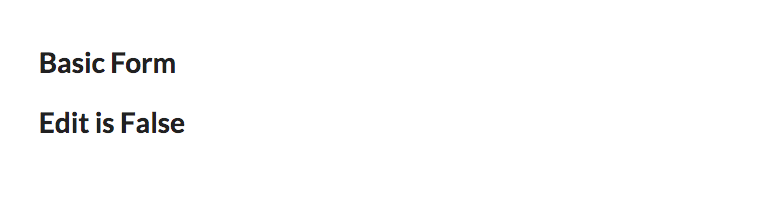
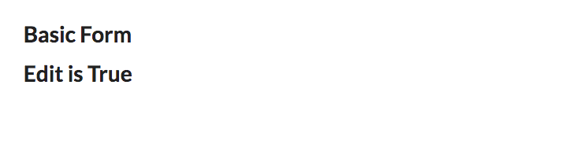

# Create a Basic React Form

## Get started
Create new component files
```
touch src/components/Basic.js
touch src/components/forms/BasicForm.js
```

### Basic.js
Copy and Paste the following code into `Basic.js`

```js
import React, { Component } from 'react';
import './main.css';

export default class Basic extends Component{
    render(){
        return(
            <div className="main">
                <h1>Basic Form</h1>
            </div>
        )
    }
}
```
`Basic.js` is the parent container for the basic form and the edit profile button. It will need to hold state. It will determine which component renders based on the state.

In this example, we hardcode the state of the user, but the user object can be set from an API call as well.

Here is the state of `Basic.js`
```js
state = {
        person: {
            name: "Teresa",
            email: "this@that.com"
        },
        edit: false,
    }
```
As you can see state.edit is false on the initial render. In the next few steps, we will decide how the component will respond to a change of state on the edit item.

### Handling the state change and rendering the components

```js
editProfile = () => {
        if(this.state.edit){
            return(
                <div>
                   <h1>Edit is True</h1>
                </div>
            )
        }else{
            return(
                <h1>Edit is False</h1>
            )
        }
    }
```
The full component now looks like this: 
NOTE we have included the function in the return `{this.editProfile()}` to handle which `<h1>` displays in the body of the component. 
```js
export default class Basic extends Component{
    state = {
        person: {
            name: "Teresa",
            email: "this@that.com"
        },
        edit: false,
    }

    editProfile = () => {
        if(this.state.edit){
            return(
                <div>
                   <h1>Edit is True</h1>
                </div>
            )
        }else{
            return(
                <h1>Edit is False</h1>
            )
        }
    }

    render(){
        return(
            <div className="main">
                <h1>Basic Form</h1>
                {this.editProfile()}
            </div>
        )
    }
```

#### We see this:



#### Change the edit in state to true and this is how it renders:



### Add code to `BasicForm.js`

Add the follwing to `BasicForm.js`.

NOTE: Forms ALWAYS are stateful because they are capturing the user input in order to do something with it...

```js
import React, {Component} from 'react';
//We are using semantic-ui-react and these styles are packaged with the framework
import { Form, Input, Button } from 'semantic-ui-react'

export default class BasicForm extends Component{

state = {
    fields: {
      name: this.props.person.name || '',
      email: this.props.person.email
    }
  };

  onFormSubmit = evt => {
    const email = this.state.fields.email;
    const name = this.state.fields.name;
    this.props.saveUpdate(name, email);

    this.setState({
      fields: {
        name: '',
        email: ''
      }
    });
    evt.preventDefault();
  };

  onInputChange = evt => {
    const fields = Object.assign({}, this.state.fields);
    fields[evt.target.name] = evt.target.value;
    this.setState({fields});
  };

  render() {
    return (
      <div>
        <h3>Edit Your Profile</h3>
         <Form>
            <Form.Group widths='equal'>
            <Form.Field>
                <label>Update Name</label>
                <Input 
                    fluid placeholder='Name' 
                    name="name"
                    value={this.state.fields.name}
                    onChange={this.onInputChange}
                />
            </Form.Field>
            <Form.Field>
                <label>Update Email</label>
                <Input 
                    fluid placeholder='Email' 
                    name="email"
                    type='email'
                    value={this.state.fields.email}
                    onChange={this.onInputChange}
                />
            </Form.Field>
            </Form.Group>
            <Button 
                size='mini' 
                color='green'
                onClick={this.onFormSubmit}
            >
                Save                       
            </Button>
        </Form>
      </div>
    );
  }
}
```


