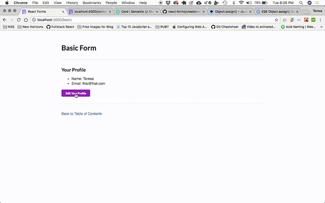

# Create a Basic React Form

## Get started
Create new component files
```
touch src/components/Basic.js
touch src/components/forms/BasicForm.js
```

### Basic.js
Copy and Paste the following code into `Basic.js`

```js
import React, { Component } from 'react';
import './main.css';

export default class Basic extends Component{
    render(){
        return(
            <div className="main">
                <h1>Basic Form</h1>
            </div>
        )
    }
}
```
`Basic.js` is the parent container for the basic form and the edit profile button. It will need to hold state. It will determine which component renders based on the state.

In this example, we hardcode the state of the user, but the user object can be set from an API call as well.

Here is the state of `Basic.js`
```js
state = {
        person: {
            name: "Teresa",
            email: "this@that.com"
        },
        edit: false,
    }
```
As you can see state.edit is false on the initial render. In the next few steps, we will decide how the component will respond to a change of state on the edit item.

### Handling the state change and rendering the components

```js
editProfile = () => {
        if(this.state.edit){
            return(
                <div>
                   <h1>Edit is True</h1>
                </div>
            )
        }else{
            return(
                <h1>Edit is False</h1>
            )
        }
    }
```
The full component now looks like this: 
NOTE we have included the function in the return `{this.editProfile()}` to handle which `<h1>` displays in the body of the component. 
```js
export default class Basic extends Component{
    state = {
        person: {
            name: "Teresa",
            email: "this@that.com"
        },
        edit: false,
    }

    editProfile = () => {
        if(this.state.edit){
            return(
                <div>
                   <h1>Edit is True</h1>
                </div>
            )
        }else{
            return(
                <h1>Edit is False</h1>
            )
        }
    }

    render(){
        return(
            <div className="main">
                <h1>Basic Form</h1>
                {this.editProfile()}
            </div>
        )
    }
```

#### We see this:

#### Change the edit in state to true and this is how it renders:


### Add code to `BasicForm.js`

Add the follwing to `BasicForm.js`.

NOTE: Forms ALWAYS are stateful because they are capturing the user input in order to do something with it...

```js
import React, {Component} from 'react';
//We are using semantic-ui-react and these styles are packaged with the framework
import { Form, Input, Button } from 'semantic-ui-react'

export default class BasicForm extends Component{

state = {
    fields: {
      name: this.props.person.name || '',
      email: this.props.person.email
    }
  };

  onFormSubmit = evt => {
    const email = this.state.fields.email;
    const name = this.state.fields.name;
    this.props.saveUpdate(name, email);

    this.setState({
      fields: {
        name: '',
        email: ''
      }
    });
    evt.preventDefault();
  };

  onInputChange = evt => {
    const fields = Object.assign({}, this.state.fields);
    fields[evt.target.name] = evt.target.value;
    this.setState({fields});
  };

  render() {
    return (
      <div>
        <h3>Edit Your Profile</h3>
         <Form>
            <Form.Group widths='equal'>
            <Form.Field>
                <label>Update Name</label>
                <Input 
                    fluid placeholder='Name' 
                    name="name"
                    value={this.state.fields.name}
                    onChange={this.onInputChange}
                />
            </Form.Field>
            <Form.Field>
                <label>Update Email</label>
                <Input 
                    fluid placeholder='Email' 
                    name="email"
                    type='email'
                    value={this.state.fields.email}
                    onChange={this.onInputChange}
                />
            </Form.Field>
            </Form.Group>
            <Button 
                size='mini' 
                color='green'
                onClick={this.onFormSubmit}
            >
                Save                       
            </Button>
        </Form>
      </div>
    );
  }
}
```
`BasicForm.js` is doing a lot of stuff!
When we initialize the component in `Basic.js` we will pass it the user object in state as props. First, let's look at the `onInputChange` function.

This function allows all user values to be compiled into an object and set state on change so that you don't need multiple functions to handle each input field.
```js

onInputChange = evt => {
    //Object.assign() clones the fields object in state and returns the target object. It has a signature of Object.assign(target, ...sources).
    const fields = Object.assign({}, this.state.fields);
    fields[evt.target.name] = evt.target.value;
    this.setState({fields});
  };
```

The `onFormSubmit` function handles when the submit button is clicked. It passes the user input up to the parent component by calling a function that was passed as props. This is called "Inverse data flow."

```js
onFormSubmit = evt => {
    const email = this.state.fields.email;
    const name = this.state.fields.name;

    // The function that was passed as props from the parent
    this.props.saveUpdate(name, email);

    this.setState({
      fields: {
        name: '',
        email: ''
      }
    });
    evt.preventDefault();
  };
```

### `Basic.js` Completed Code

```js
import React, { Component } from 'react';
import { Link } from 'react-router-dom';
import { Divider } from 'semantic-ui-react';
import './main.css';
import BasicForm from './forms/BasicForm';
import { Button } from 'semantic-ui-react'

export default class Basic extends Component{
    state = {
        person: {
            name: "Teresa",
            email: "this@that.com"
        },
        edit: true,
    }

    editProfile = () => {
        if(this.state.edit){
            return(
                <div>
                    <Divider section />
                    <BasicForm person={this.state.person} saveUpdate={this.saveUpdate}/>
                </div>
            )
        }else{
            return(
                <Button 
                size='mini' 
                color='purple'
                onClick={this.toggleEdit}
                >
                    Edit Your Profile                       
                </Button>
            )
        }
    }

    saveUpdate = (name, email) => {
        this.setState({
            person: {
                name: name,
                email: email
            },
            edit: false,
        })
    }

    toggleEdit = () => {
        this.setState({
            edit: true,
        })
    }

    render(){
        return(
            <div className="main">
            
                <h1>Basic Form</h1>

                <Divider section />
                    <div>
                    <h3>Your Profile</h3>
                    <ul>
                        <li>
                            Name: {this.state.person.name} 
                        </li>
                        <li>Email: {this.state.person.email}</li>
                    </ul>
                   
                    {this.editProfile()}

                    </div>

                <Divider section />

                <Link to={`/`} className='backLink'>
                    Back to Table of Contents
                </Link>
            </div>
        )
    }
}
```
As you can see, we have created functions that will be passed as props and functions that will update the state for the app to render the relevant component. See the app in action below.

